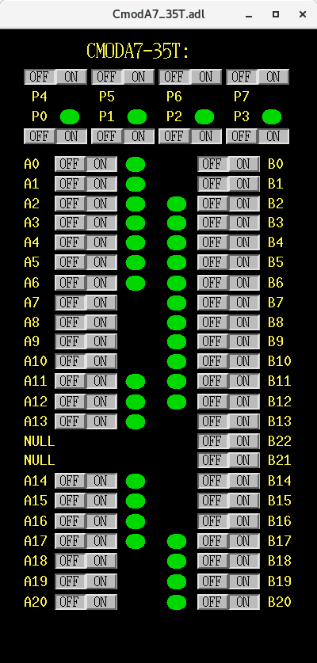

# SoftIOC for Cmod A7-35T DI/O control
This project is aimed at enabling the control of digital I/O on Cmod A-35T board, 
and integrating it into the EPICS-based control system. The following work is included 
in this work:
1. Files to program the hardware of the Cmod A7-35T FPGA board, which enables the setting and
   readback of the pin status on the board;
2. A python script to control the board using the serial port communication;
3. A python script-based softIOC that can run on an EPICS server.
4. GUI developed with MEDM. 

## 1. Program the hardware of Cmod A7-35T 
### 1.1 Preparation
- [Cmod A7-35T board](https://digilent.com/shop/cmod-a7-35t-breadboardable-artix-7-fpga-module/)
- [Vivado 2018.2](https://www.xilinx.com/support/download/index.html/content/xilinx/en/downloadNav/vivado-design-tools/archive.html)
- USB A to micro B cable
### 1.2 Program the hardware 
The files required to program the Cmod A7-35T board can be found in the folder `Hardware`. 
The steps of programing is written, which can be found in the 
[ProgramCmodA7-35T.md](Hardware/ProgramCmodA7-35T.md) in `Hardware`. 

## 2. Run the IOC
1.1 Preparation
The softIOC was developed with python, and `pythonSoftIOC` is the main module that provides the 
interface with EPICS. The python script was developed and tested with `Python 3.10.4`.
## 2.1 Preparation
- Python 3 installed, the modules used include
  - Commonly used modules: `serial`, `time`, `math`, `sys`, `struct`.
  - EPICS related modules: [asyncio](https://pypi.org/project/asyncio/), [softioc](https://pypi.org/project/softioc/)

The `root` privilege is required to run the IOC script. It should be carefully checked for the 
`root` user, which might be different from the common users. 

It should also be noted that the `serial` is installed with 
```
pip install pyserial
```

To check the python version and installed modules for the `root` user, use the following commands:
```
sudo python --version
sudo pip list
```

### 2.2 Run the IOC
Running the IOC is straightforward, put the two python scripts under `Scripts` into your 
directory, and run the [IOC_CmodA735T_DIO.py](Scripts/IOC_CmodA735T_DIO.py) to start the IOC. 
Execute privilege should be assigned to this script. It can also be run as `root` without `sudo`.
```
sudo chmod +x IOC_CmodA735T_DIO.py
sudo ./IOC_CmodA735T_DIO.py
```
If your default Python is `Python3`, the script header can be changed to 
```
#!/usr/bin/env python
```

The usb port should be checked on the IOC server, usually it is `COMXX` in windows and 
`/dev/ttyUSBXX` in linux. The default setting in [IOC_CmodA735T_DIO.py](Scripts/IOC_CmodA735T_DIO.py) 
is `/dev/ttyUSB1` for testing in a linux system. It should be changed to the correct
port if different.

### 2.3 MEMD-based GUI
On the client-server, add the IOC server is in the `EPICS_CA_ADDR_LIST`. Then, run the 
`CmodA7_35T_Main.adl`, click the button to open the control panel.

<left>
    </left>

The buttons are layout in a way that is consistent with the position of the pins.


## Reference
- Python module: [pythonSoftIOC](https://github.com/dls-controls/pythonSoftIOC)
- [7 Series FPGAs and Zynq-7000 SoC XADC Dual 12-Bit 1 MSPS Analog-to-Digital Converter User Guide](https://docs.xilinx.com/r/en-US/ug480_7Series_XADC/7-Series-FPGAs-and-Zynq-7000-SoC-XADC-Dual-12-Bit-1-MSPS-Analog-to-Digital-Converter-User-Guide-UG480)
- [Cmod A7 Reference Manual](https://digilent.com/reference/_media/cmod_a7/cmod_a7_rm.pdf?_ga=2.9108277.12391635.1668662559-346125063.1666201229)